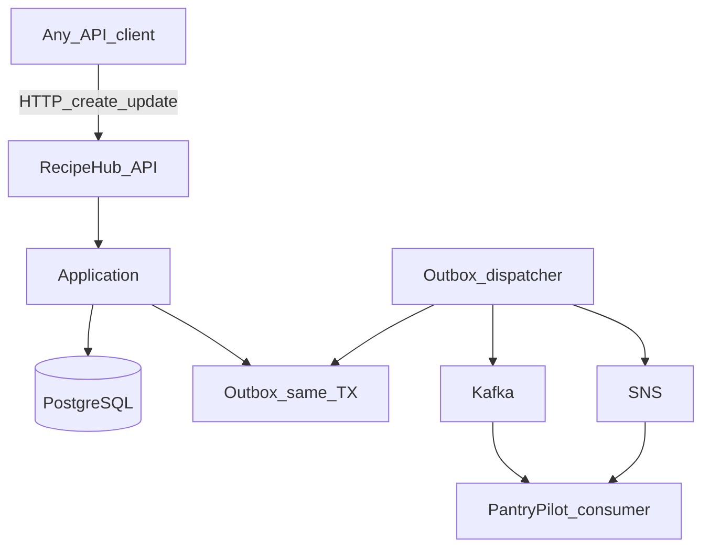

# RecipeHub — Detailed Implementation Plan

**Life Atlas Project 2** · Recipe and Ingredient Catalog (EDA Producer)  
**Location:** `LifeAtlas/recipe-hub/`  
**Stack:** C# 14, .NET 10 LTS, ASP.NET Core, PostgreSQL, OpenTelemetry  
**Messaging:** Transactional outbox → Kafka and/or SNS (CloudEvents)

**Downstream consumer (v1):** PantryPilot · **Later:** MemoryAtlas

---

## Product goal

Own the **canonical ingredient catalog** and **recipe** source of truth for Life Atlas. Any client (PantryPilot, admin tooling, demos, future apps) can create and update recipes via API; RecipeHub publishes versioned events so planners and search can stay in sync without sharing a database.

**Core principle:** RecipeHub is a **thin writer + publisher**. It does not plan meals, track pantry stock, own shopping lists, or model households. Matching reliability comes from **canonical ingredient ids**, not fuzzy free text.

**Tenancy note (decided):** Household is a **PantryPilot** concept. RecipeHub does **not** scope recipes by `household_id`. Which recipes a household *uses* for planning is PantryPilot’s association/projection concern.

### Decisions locked (grilling)

| Topic | Decision |
|-------|----------|
| Household | Not in RecipeHub |
| Visibility | Shared catalog; globally readable |
| Author | Optional display name (search / MemoryAtlas filter) |
| Creator | `jwt.sub` (Google OIDC); creator-only update/delete |
| Starters | Immutable; variant = client GET + POST (no copy endpoint) |
| Auth | Google OIDC JWT on writes; open reads; standalone-testable |
| Delete | Soft-delete + configurable purge (default 90 days); `lifeatlas.recipe.deleted` |
| Update events | Full snapshot |
| Ids | UUID |
| Ingredients | Large seed; admin-only POST; LLM resolve = v2 |
| Units | `pcs` \| `g` \| `ml` \| `pack` |
| Idempotency | `(creatorId, Idempotency-Key)` → stored response; ~24h TTL |
| Publish local | `console` first; Kafka/SNS week 2–3 |
| Steps | Optional ordered text list |
| Lineage | No `sourceRecipeId` in v1 |

---

## v1 scope

### In scope

- No household tenancy in RecipeHub
- Global **ingredient catalog** with a **large seed** on deploy; `POST /ingredients` is **admin-only** (allowlisted Google `sub`s) in v1
- **Shared recipe catalog** — all recipes globally readable; not a personal recipe journal
- Recipe CRUD (title, optional **author** name, meal slot hints, steps optional, ingredient lines with catalog id + quantity + unit)
- Recipes may only reference **existing** catalog ingredient ids in v1 (no create-on-write)
- **Creator-only mutate:** only the recipe’s creator may update or delete; others who want changes create a **new** recipe
- Curated **starter pack** — immutable after seed; variants = client **GET + POST** (no copy endpoint)
- **Soft-delete** recipes (`deleted_at`); hidden from default lists; creator-only
- **Retention purge:** background job hard-deletes soft-deleted rows after a configurable period (default **90 days** / GDPR-oriented retention) — Postgres has no native row TTL; implement as scheduled purge, not DB TTL
- List/filter recipes including **partial match on author** (for discovery + MemoryAtlas event filtering later)
- `Idempotency-Key` on create/update writes — keyed by `(creatorId, key)`, ~24h TTL
- Units: `pcs` \| `g` \| `ml` \| `pack`; optional ordered steps; no `sourceRecipeId` lineage
- Publish modes: console (local), Kafka, SNS, or both (feature/config flag)
- OpenAPI + RFC 9457 Problem Details
- Docker Compose: API + PostgreSQL (+ optional Kafka)
- Full `docs/` package (system-design, trade-offs, production-next, integration, ADRs)
- Auth: **Google OIDC JWT Bearer** on writes; `creatorId = token.sub` (Apple later)
- **Open reads** (no token) for catalog/recipes; create/update/delete require valid Google JWT
- Local/dev testability without other Life Atlas apps (Compose + token via OAuth Playground / test helper; tests use signed test JWTs or auth bypass in Development)

### Out of v1

- Product UI (thin admin/CRUD UI → v2)
- LLM-assisted ingredient resolve/insert on recipe write (v2 — see AI boundary)
- Full-text / cuisine / “main ingredient” search platform (basic list/filter OK)
- AI-generated recipes
- PantryPilot or trip awareness
- Apple Sign-In (Google OIDC only in v1)
- Mutating starter-pack recipes
- Household / multi-tenant isolation inside RecipeHub
- Billing

---

## Repository layout

```
recipe-hub/
├── src/
│   ├── RecipeHub.Api/              # Minimal APIs, OpenAPI, middleware
│   ├── RecipeHub.Application/      # Use cases, DTOs, validators
│   ├── RecipeHub.Domain/           # Entities, value objects, domain events
│   ├── RecipeHub.Infrastructure/   # EF Core, outbox, Kafka/SNS publishers
│   └── RecipeHub.Contracts/        # CloudEvents JSON Schema / shared DTOs
├── tests/
│   ├── RecipeHub.Domain.Tests/
│   ├── RecipeHub.Application.Tests/
│   └── RecipeHub.Api.Tests/
├── docs/
│   ├── system-design.md
│   ├── trade-offs.md
│   ├── production-next.md
│   ├── integration.md
│   └── adr/
├── docker-compose.yml
├── RecipeHub.sln
└── README.md
```

**Architecture:** clean/use-case layers — domain and application testable without HTTP or brokers.

---

## Domain model (v1)

| Aggregate / entity | Responsibility |
|--------------------|----------------|
| `Ingredient` | Canonical id, name, aliases[], default unit, active flag |
| `Recipe` | Title, optional author, creator id, meal slots, optional cuisine tags, status; shared catalog (globally readable); creator-only update/delete |
| `RecipeIngredient` | Recipe line: ingredient id, quantity, unit, optional notes |
| `RecipeStep` | Optional ordered instruction text (v1 may keep steps as a simple list on recipe) |
| `OutboxMessage` | Pending integration event payload + publish status |

**Not in RecipeHub:** `Household` — lives in PantryPilot.

**Value objects:** `Quantity`, `Unit` (`pcs` \| `g` \| `ml` \| `pack`), `MealSlot`, `IngredientAlias`

**Matching contract:** PantryPilot (and others) must store/reference the same `ingredient_id`. Free-text labels are display-only.

---

## Write and publish flow



1. Validate recipe ingredients all resolve to catalog ids.
2. Persist recipe + outbox row in **one transaction**.
3. Background dispatcher publishes CloudEvent; marks outbox published (at-least-once; consumers idempotent).

---

## API surface (v1)

| Method | Path | Purpose |
|--------|------|---------|
| GET | `/ingredients` | List/search catalog (name/alias contains) |
| GET | `/ingredients/{id}` | Get ingredient |
| POST | `/ingredients` | Admin-only add ingredient (allowlisted `sub`) |
| GET | `/recipes` | List recipes (optional filters: author contains, meal slot, title contains) |
| GET | `/recipes/{id}` | Get recipe with ingredients |
| POST | `/recipes` | Create recipe (Idempotency-Key); client copies starters via GET then POST |
| PUT/PATCH | `/recipes/{id}` | Update recipe (creator only; not starters) |
| DELETE | `/recipes/{id}` | Soft-delete (creator only); hard purge via retention job |
| GET | `/health` | Health check |

**Auth (v1):** Google OIDC JWT Bearer on mutating recipe routes; `creatorId = jwt.sub`. Starters immutable. **GET** ingredients/recipes/health are open (no token). No `X-Household-Id`. Local demos obtain a Google ID token without PantryPilot (OAuth Playground, Swagger “Authorize”, or a tiny token helper).

**Errors:** RFC 9457 Problem Details

---

## Database (PostgreSQL)

**Tables:** `ingredients`, `ingredient_aliases`, `recipes`, `recipe_ingredients`, `recipe_steps` (optional), `integration_outbox`, `idempotency_records`

**Decisions:**

- Ingredient / recipe ids: **UUID** (Postgres `uuid`, .NET `Guid`); JSON as string
- No `household_id` on recipes; optional `author` string; starters immutable (`is_platform`); `creatorId` from JWT `sub` for user recipes
- Soft-delete + retention purge (default 90 days)
- Idempotency: unique `(creator_id, idempotency_key)` with response snapshot + expiry
- Outbox stores CloudEvents JSON body + `event_type` + `aggregate_id` + `occurred_at`

---

## Life Atlas integration events

CloudEvents-style JSON, `eventVersion: "1.0"`:

| Event type | When |
|------------|------|
| `lifeatlas.recipe.created` | Recipe created |
| `lifeatlas.recipe.updated` | Recipe updated (full snapshot of live recipe) |
| `lifeatlas.recipe.deleted` | Recipe soft-deleted (minimal payload) |

**Payload (created/updated minimum):** `recipeId`, `title`, `author` (optional), `creatorId`, `mealSlots[]`, `ingredients[]` of `{ ingredientId, name, quantity, unit }`, `updatedAt`  
**Payload (deleted minimum):** `recipeId`, `deletedAt`, optional `author`  
*(No `householdId`. No event on retention hard-purge — consumers already reacted to soft-delete. MemoryAtlas can filter/index by author.)*

**Delivery:** transactional outbox → dispatcher → Kafka topic and/or SNS topic. Local: `PUBLISH_MODE=console|kafka|sns|both`.

**Consumers:**

- PantryPilot — refresh recipe projection for deterministic planner; associate recipe ids to households locally
- MemoryAtlas (later) — index recipe text

---

## AI boundary

| Step | Owner | Notes |
|------|-------|-------|
| Recipe create/update | API + domain | Deterministic validation; ingredient ids must already exist |
| Ingredient resolution | Catalog + seed | No NLP in v1 |
| Suggest aliases / resolve unknown ingredient on write | LLM + catalog rules | **v2** — see below |

v1 has **no AI dependency**.

### v2 ingredient resolution (planned, not v1)

When a create/update supplies an ingredient not in the catalog (or free text):

1. Ask an LLM for canonical name + known aliases / partial matches against the catalog.
2. If an **alias or name already exists** → map to that ingredient; attach any new aliases to the existing row.
3. If **nothing matches** → insert a new ingredient (with aliases), then use its id on the recipe line.

Still deterministic after resolution: PantryPilot keeps matching on `ingredient_id`, never raw LLM text.

---

## Required ADRs

| ADR | Topic |
|-----|-------|
| ADR-001 | Canonical ingredient catalog vs free-text fuzzy match |
| ADR-002 | Transactional outbox vs direct broker publish |
| ADR-003 | Kafka vs SNS vs both for local/prod |
| ADR-004 | Shared catalog (global read) vs private recipe journal |
| ADR-005 | Recipe update events: **full snapshot** (chosen) vs JSON patch |
| ADR-006 | Google OIDC JWT (`sub` = creator) vs demo API key; open reads |
| ADR-007 | Soft-delete + retention purge (default 90 days); `lifeatlas.recipe.deleted` on soft-delete, no event on hard purge |

---

## Key trade-offs (document in `docs/trade-offs.md`)

| Decision | Options | Recommended v1 | Why |
|----------|---------|----------------|-----|
| Service split | Inside PantryPilot vs separate RecipeHub | Separate C# RecipeHub | Clear EDA producer; .NET CV lane; PantryPilot stays TS jobs/planner |
| Ingredient identity | Catalog ids vs fuzzy text | Catalog ids (A) | Deterministic matching for meal prep |
| Recipe tenancy | Household-scoped vs no household in RecipeHub | No household | Recipes creatable by any client; household↔recipe link is PantryPilot’s |
| Recipe visibility | Private journal vs shared catalog | Shared catalog | Knowledge to share; author is attribution/search, not access control |
| Recipe mutation | Open wiki vs creator-only | Creator-only update/delete | Variants = new recipe; starters immutable |
| Auth | Basic vs Google OIDC vs demo key | Google OIDC JWT on writes; open reads | `sub` = creator; testable without sibling apps |
| Recipe delete | Soft + retention purge vs hard | Soft-delete; purge after ~90 days; `recipe.deleted` event | Consumer-friendly; no event on hard purge |
| Starter variants | Copy endpoint vs GET+POST | GET then POST only | Fewer endpoints; client owns the copy |
| UI | API-only vs thin UI | API-only | Keep lab thin; clients host add-recipe UX via API |
| Catalog writes | Any user vs admin + seed | Large seed; admin-only POST | Protect canonical ids; LLM assist is v2 |
| Ingredient / recipe ids | ULID vs UUID | UUID | Native Guid/uuid; opaque string in JSON contracts |
| Starter pack | Empty catalog vs seeded | Seeded starters | Cold start for PantryPilot plans |
| Steps | Rich structured vs optional text | Optional simple steps | Recipes need ingredients more than prose for v1 matching |
| Lineage | sourceRecipeId vs none | None in v1 | Keep API thin; GET+POST is enough |

---

## What I'm proving vs learning

| Proving (CV-aligned) | Learning (owned depth) |
|----------------------|------------------------|
| .NET API + OpenAPI + Problem Details | Ingredient catalog design that survives multi-consumer use |
| Transactional outbox + CloudEvents | Kafka **and** SNS publish adapters behind one port |
| Thin bounded context | Keeping a service intentionally thin (resist meal-planner / household creep) |

---

## Milestones (3 weeks, part-time)

| Week | Deliverable |
|------|-------------|
| **1** | Solution scaffold, ingredient + recipe schema, CRUD APIs, PostgreSQL, OpenAPI, Compose, docs skeleton |
| **2** | Outbox + console publisher, CloudEvents contracts, starter seed data, unit/integration tests |
| **3** | Kafka + SNS adapters, idempotency, trade-offs + ADRs, README demo, handoff to PantryPilot consumer |

### Accelerated (~6–8 focused days)

| Phase | Days | Focus |
|-------|------|-------|
| **A** | 1–2 | Scaffold + schema + CRUD |
| **B** | 2 | Outbox + console + seed |
| **C** | 2 | Kafka/SNS + contracts + docs |

---

## Demo script (GitHub README)

1. List ingredients / show starter recipes
2. Create a recipe with catalog ingredient ids (Idempotency-Key)
3. Show outbox row then console/Kafka/SNS publish of `lifeatlas.recipe.created`
4. Update recipe → `lifeatlas.recipe.updated`
5. Point PantryPilot consumer at the topic (once built)

---

## Definition of done

- [ ] All v1 endpoints working locally via Docker Compose
- [ ] Minimum 5 trade-offs + ADRs (household ADR dropped; visibility/auth ADR if needed)
- [ ] Outbox publish path proven (at least console + one broker)
- [ ] Starter pack seeds enough breakfast + dinner recipes for PantryPilot demo
- [ ] Integration contracts documented for PantryPilot (no householdId on recipe events)
- [ ] `production-next.md` covers auth, UI, search, catalog governance

---

## Production-next (outline)

1. Real auth already: Google OIDC in v1; add Apple / multi-IdP later
2. Thin CRUD UI
3. Catalog governance (who can add global ingredients)
4. LLM-assisted ingredient resolve/insert on recipe write (confirm vs auto)
5. Schema evolution / event versioning policy
6. Multi-region and DLQ for failed publishes
7. GDPR: soft-delete + retention purge already in v1; export / right-to-erasure acceleration as needed
8. Catalog governance UX beyond admin allowlist

---

## To be refined (v2+)

- Thin UI layer on top of the API
- LLM ingredient resolution on create/update (names/aliases/partial match → map to existing or insert); prefer confirm-or-auto decision in v2 grilling
- Cuisine / dish-name / main-ingredient search beyond simple filters
- Richer recipe metadata (cook time, tags, photos)
- MemoryAtlas as second event consumer
- Recipe sharing / forking model refinements (if private recipes exist)
- Apple Sign-In as second OIDC provider

---

## Thread starter prompt

```
Implement RecipeHub v1 Week 1 from LifeAtlas/recipe-hub/PLAN.md and CONTEXT.md:
- .NET 10 solution scaffold with clean architecture layers
- Ingredient catalog + recipe CRUD with PostgreSQL + EF Core
- No household tenancy; shared catalog; UUID ids
- Google OIDC JWT on writes (creatorId = sub); open reads; starters immutable
- Soft-delete (+ retention job stub OK in week 1); RFC 9457; Idempotency-Key on writes
- Docker Compose, OpenAPI, docs skeleton
Follow PLAN.md / CONTEXT.md exactly. Outbox console publisher can start Week 2; Kafka/SNS Week 3.
```
